# Run MoltenRock Trade on your own free Cloudflare account

About 15 minutes, no terminal, no code. You create two free accounts, click one button, and your AI agent does the rest. The same guide, in German, French and Italian too, is at **[moltenrocktrade.com/start](https://moltenrocktrade.com/start)**.


## What you need

- [ ] **A Cloudflare account**: free. Your portal runs there, with your data in the EU.
- [ ] **A GitHub account**: free. Cloudflare keeps your own copy of the app there.
- [ ] **An AI agent, for example Claude**: the free Claude plan is enough to connect it.
- [ ] **Your online shop – any system**: WooCommerce connects with a read-only key your agent asks you for later; for Shopify, Wix, Squarespace or your own website, your agent reads your products and you confirm the prices.

## What's an AI agent?

An AI agent is an AI assistant, like Claude, that can do more than chat: it can use tools. Here it connects to your trade portal and does the setup work for you. It imports your products, writes the texts in four languages and sets your prices and terms. You stay in charge: it asks you when it needs something, it can never change your bank details, and it never approves customers or large orders itself.

**Don't have one yet?** Create a free account at [claude.ai](https://claude.ai), or install the Claude app for Mac or Windows ([claude.com/download](https://claude.com/download)). That's all you need.

## Step by step

### 1. Create a GitHub account
1. Go to [github.com/signup](https://github.com/signup).
2. Enter your email, a password and a username, then confirm the code GitHub emails you.
3. The free plan is all you need.

*Why:* Cloudflare puts your own copy of MoltenRock Trade there, and updates arrive the same way.

### 2. Create a Cloudflare account
1. Go to [dash.cloudflare.com/sign-up](https://dash.cloudflare.com/sign-up).
2. Enter your email and a password, then confirm the email Cloudflare sends you.
3. Stay on the free plan.

### 3. Create your database in the EU (recommended)
1. In Cloudflare, open **Storage & databases → D1 SQLite Database** and click **Create Database**.
2. *Name*: exactly **`moltenrock-trade`**.
3. *Data location*: choose **Specify jurisdiction**, open **Provide a jurisdiction** and pick **The European Union**. Then click **Create**.

Not *Location* with a *location hint*: that only suggests a region. Only **Specify jurisdiction** keeps the data in the EU, and it can't be changed later. Do this **before step 4**: the Deploy page then picks this database by itself.

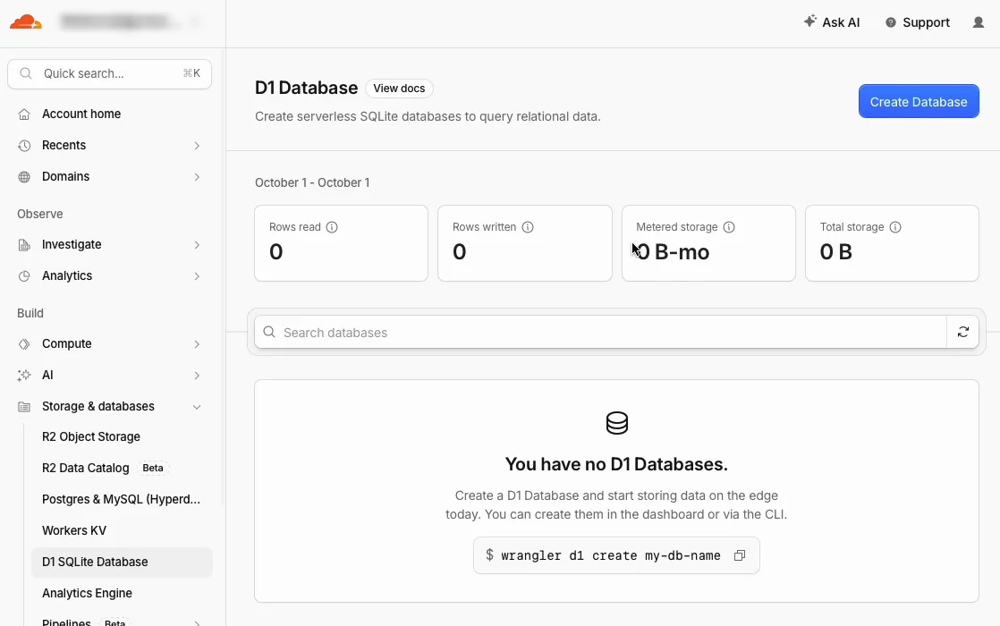
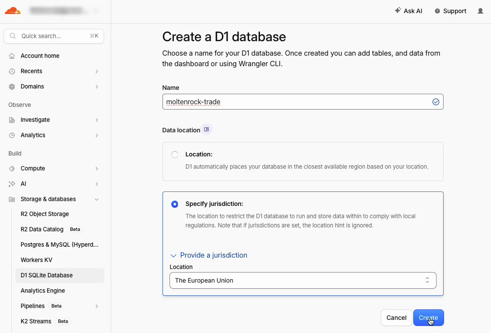

### 4. Click "Deploy to Cloudflare"
[](https://deploy.workers.cloudflare.com/?url=https://github.com/Goldcote/moltenrock-trade)

1. Under *Git account*, click **New GitHub connection**.
2. GitHub asks which repositories Cloudflare may use. A new GitHub account: leave **All repositories** (it will only hold this app). You already use GitHub: choose **Only select repositories** and pick any one. Click **Install & Authorize**; GitHub may ask for your two-factor code.
3. Back in Cloudflare: tick **Create private Git repository**. *Project name*: keep `moltenrock-trade` or use your own, like `alpenrose-trade`.
4. *Select D1 database* must say **`moltenrock-trade`**. If it says *+ Create new*, your EU database is missing: do step 3 first.
5. **`OWNER_EMAIL`**: your own email address. Only this address can create the shop.
6. Leave everything else as it is and click **Deploy**. After about two minutes the log says *Success*. Your address is the line under *Deployed … triggers*, ending in `.workers.dev`.

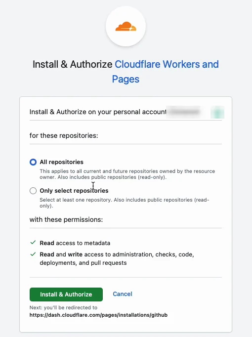
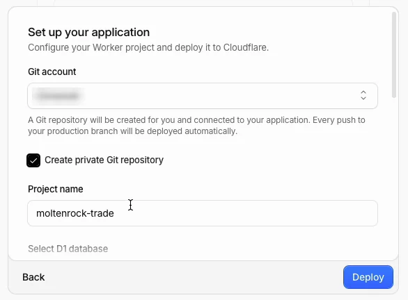
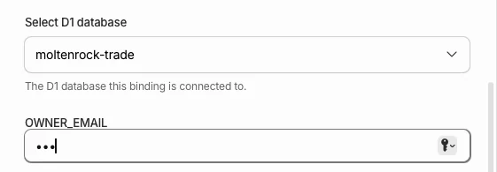
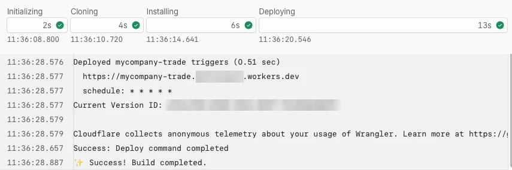

**Something went differently?**
- *"A repository with that name already exists"*: change the *Project name* and click **Deploy** again.
- Your address only shows *Hello World*: a known Cloudflare hiccup ([workers-sdk#14553](https://github.com/cloudflare/workers-sdk/issues/14553)). Delete the Worker (*Settings → Delete*) and the new repository on GitHub, then deploy again.
- You chose *Only select repositories*: on GitHub open *Settings → Applications → Cloudflare Workers and Pages → Configure* and check that your new repository is listed, so updates deploy automatically.

### 5. Open your address and sign up
1. Open your address (the `.workers.dev` line from step 4). You land on **Set up your trade portal**.
2. Fill in your company and address and your email (**the same one as `OWNER_EMAIL`**). UID and IBAN can wait: add the IBAN before your first order (Setup → *Company and bank details*); it's printed on every invoice, and trade customers can't order until it's there.
3. Click **Create portal**. You're signed in straight away and land on **Setup**.

Your agent can never change these details; only you can. Do this right after deploying.

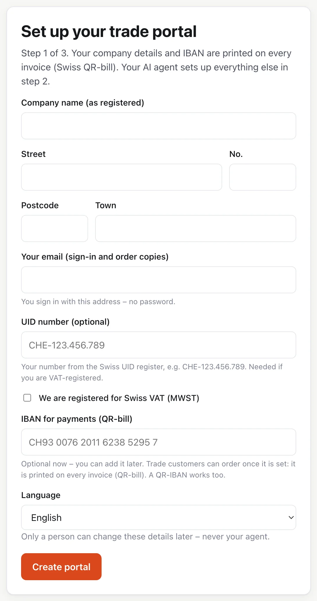

### 6. Connect your AI agent
**Claude app (the free plan works):**
1. Open the Claude app or claude.ai. In the left sidebar click **Customize**, then the **Connectors** tab, then **+ Add** (top right) → **Add custom connector**.
2. *Name*: `MoltenRock Trade`. *MCP server URL*: your portal address followed by `/mcp`, e.g. `https://moltenrock-trade.your-name.workers.dev/mcp`. Click **Continue**.
3. Leave the sign-in options as they are (*Sign in now*, *Register automatically*) and click **Add**.
4. Click **Connect**. Your browser opens: log in to Claude if asked, then click **Allow** on your portal.
5. In a chat: **+** (bottom left) → **Connectors** → switch on *MoltenRock Trade*.

Claude sends you to your **default browser**: open your portal there first. Signed in somewhere else? In your portal use **Setup → Sign in on another browser** and open that link in the default browser (no email needed).

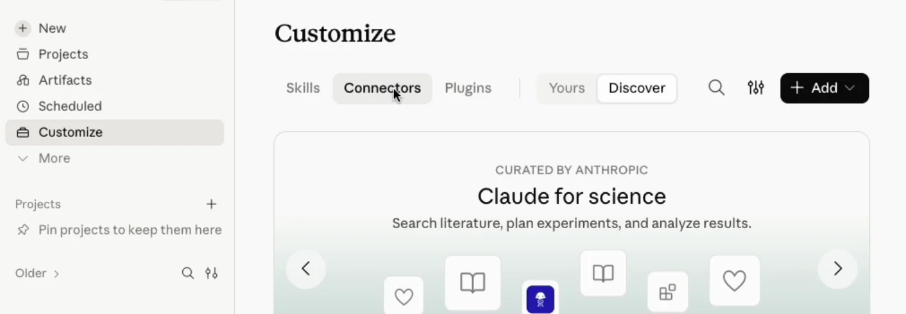
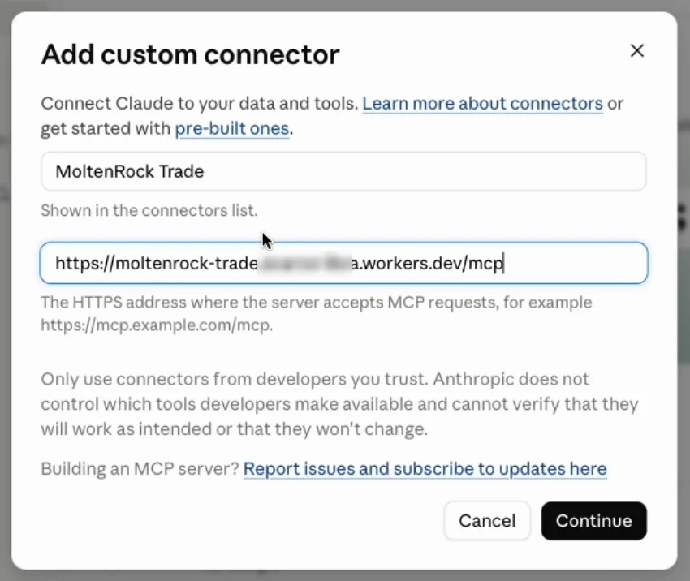
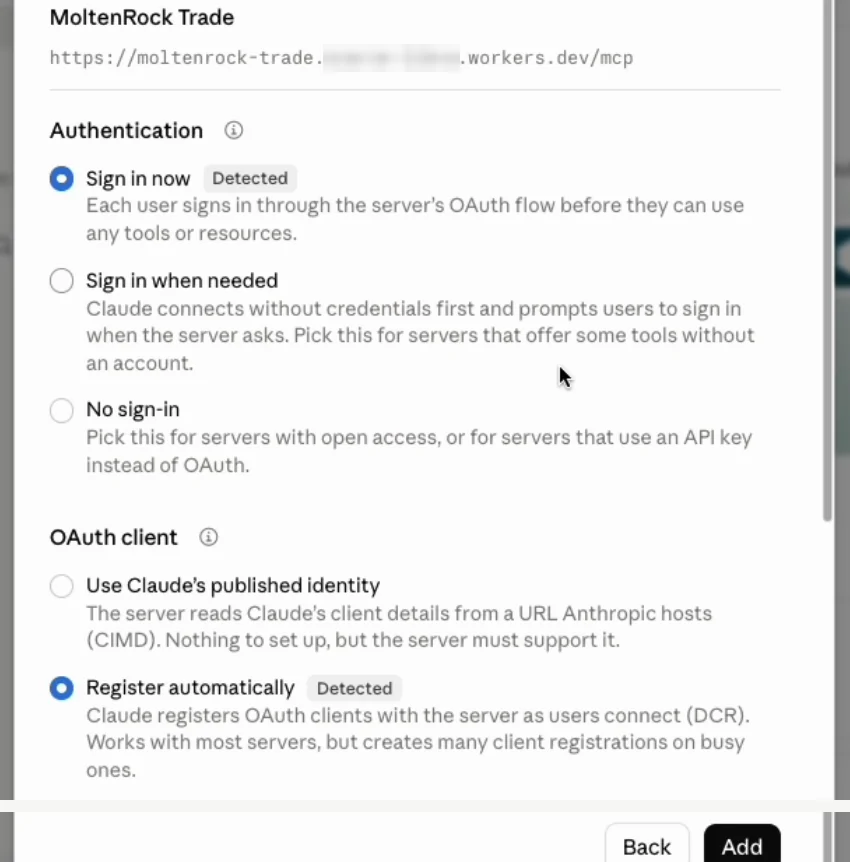
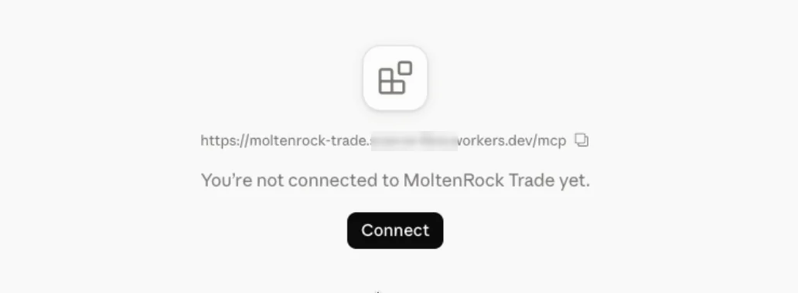

*Agents that can't sign in themselves* (or if the sign-in won't work): in your portal open Setup → step 2 → *Another agent, or connect with an access key*, create a key, and send it as the header `X-API-Key` (in Claude: *No sign-in* → *Request headers* → *Add header*).

**Claude Code (paid Claude plan):**
```bash
curl -fsSL https://claude.ai/install.sh | bash        # Mac and Linux; Windows: see code.claude.com
claude mcp add --transport http moltenrock-trade https://moltenrock-trade.your-name.workers.dev/mcp
```
Then type `/mcp` in Claude Code, choose *moltenrock-trade* → **Authenticate**, and click **Allow** in your portal.

### 7. Paste these instructions into your agent
Copy this and send it to your agent. It works through the setup and asks you whenever it needs something. (Setup in your portal has the same text in your language, with a Copy button.)

```text
Set up my MoltenRock Trade portal. Start with get_setup_status and follow next_action until everything is done.
– Ask me which shop system I use. WooCommerce: ask me for a read-only key and tell me exactly where to click (WooCommerce → Settings → Advanced → REST API → Add key, Permissions: Read). Any other shop – Shopify, Wix, Squarespace, my own website – or a spreadsheet I give you: read the products yourself and add them with upsert_products, with the page each price came from. Never guess a price.
– Write every product text in German, French, Italian and English. Swiss German uses “ss”, never “ß”.
– Go through the defaults with me one at a time, in plain words, and only change what I ask for.
– Never approve anything yourself, prices included: prepare it and tell me to confirm it under Approvals.
– When you’re done, give me a short summary and the link to my status page.
```

Then, in your portal under **Setup → Before your first trade customer**, confirm the terms and privacy notice ([LEGAL.md](LEGAL.md)) and set up email.

**Done.**

### Optional: use your own address
Your portal can run on your own domain, for example `b2b.yourshop.ch`. The domain has to be managed in Cloudflare (*Domains* in the Cloudflare menu).
1. In Cloudflare open **Workers & Pages → your portal → Settings → Domains & Routes → Add → Custom domain**.
2. Enter your address and click **Add domain**. Cloudflare sets up the certificate within a few minutes.

Your `.workers.dev` address keeps working too.

## The quick way: let Claude Code deploy it for you

With Claude Code (paid Claude plan) you can skip steps 3 and 4: it creates the EU database and deploys for you. You only sign in to Cloudflare in your browser when it asks. Paste this, then continue with step 5:

```text
Deploy MoltenRock Trade on my own Cloudflare account, with the data in the EU.
1. Clone https://github.com/Goldcote/moltenrock-trade into a new folder and run npm install.
2. Run npx wrangler login and wait while I sign in to Cloudflare in my browser.
3. Create the database in the EU: npx wrangler d1 create moltenrock-trade --jurisdiction eu
4. Deploy: npx wrangler deploy
5. Tell me the https address it prints. Then stop: I sign up on that page myself.
Never ask me for passwords or keys in this chat.
```

This way your copy lives on your computer instead of GitHub; [UPDATING.md](UPDATING.md) covers both.

---

## Optional extras

| What | How | Cost |
|---|---|---|
| **Your own address** (e.g. `b2b.yourshop.ch`) | Workers & Pages → `moltenrock-trade` → Settings → Domains & Routes → Add custom domain (your domain must be on Cloudflare) | free |
| **Emails sent automatically** (sign-in links, order confirmations) | Create a free [Resend](https://resend.com) account and an API key, then in Workers & Pages → `moltenrock-trade` → Settings → Variables and Secrets add `RESEND_API_KEY` and `MAIL_FROM` (e.g. `Shop <b2b@yourshop.ch>`). Without email, you forward sign-in links yourself: **Approvals → Trade customers → Create sign-in link**. | free tier |
| **One-click PDF invoices** | Invoices always work as a print-ready page ("Print / PDF" in the browser). The server-generated PDF download needs Cloudflare's **Workers Paid** plan, because making a PDF needs more computing time than the free plan allows. | USD 5 / month, billed by Cloudflare (not by us) |
| **Stronger key separation** | By default the app keeps its own security keys in its database. To keep them outside it, add `SESSION_SECRET` (random text) and `ENCRYPTION_KEY` (32 random bytes, base64) as Worker secrets — then reconnect your shop once through your agent. | free |

## What the free plan covers
Up to 100,000 requests a day and Cloudflare's free database tier — far more than a trade portal needs. Order confirmations run on a timer (1 of the 5 free timers).

## Good to know
- **Sign up right after deploying.** Until the setup page is completed, whoever opens it first could claim the shop — `OWNER_EMAIL` limits that to your address.
- **Updates:** the portal tells you when a new version is out (Dashboard, Status → Software). Updating is a few clicks in your GitHub copy: see [UPDATING.md](UPDATING.md).
- **Before your first trade customer:** Setup step 4, where you confirm the terms and privacy notice (built-in templates or your own pages, see [LEGAL.md](LEGAL.md)) and set up email.
- **Your shop is only ever read**: MoltenRock Trade reads your catalogue with a read-only key and never changes your shop.

## For developers (terminal)
```bash
git clone https://github.com/Goldcote/moltenrock-trade && cd moltenrock-trade && npm install
npx wrangler login
npx wrangler d1 create moltenrock-trade --jurisdiction eu    # no database_id needed in wrangler.toml
npx wrangler deploy
```
